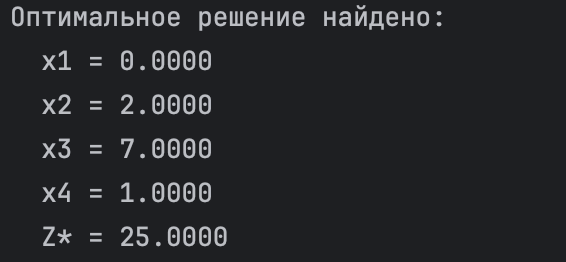
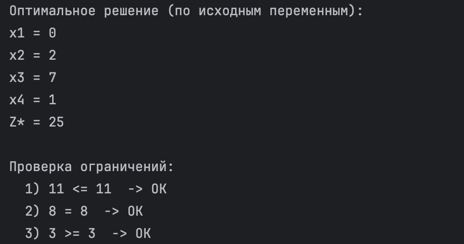
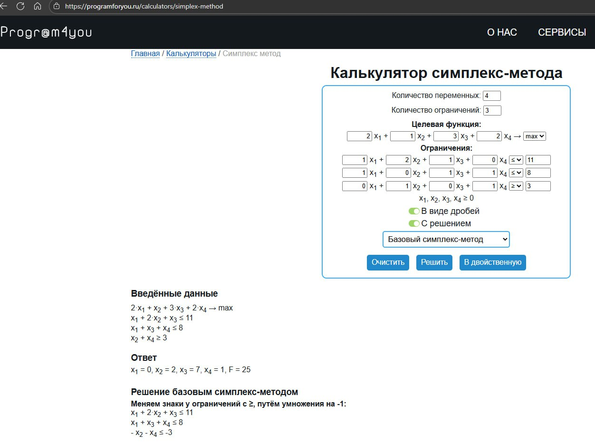

# Лабораторная работа: Решение задачи линейного программирования

**Автор:** Крамарь Кирилл Александрович  
**Поток:** K3339  
**Вариант** 412978 / 20 = 20648,9 - 9-ый вариант

---

## Краткое описание алгоритма с решателем

Задача линейного программирования (ЗЛП) решается симплекс методом.  
Программа автоматически:
1. Считывает входной файл с коэффициентами.  
2. Приводит задачу к стандартной форме.  
3. Передаёт задачу решателю линейного программирования (алгоритм Highs Simplex).  
4. Выводит найденное оптимальное решение и значение целевой функции.

## Краткое описание алгоритма без решателя

Реализован **двухфазный симплекс-метод** с нуля (без SciPy/PuLP и т.п., используется только `numpy`):

- Для `<=` добавляется **добавочная** (slack) переменная.  
- Для `>=` — **вычитаемая** (surplus) и **искусственная** (artificial).  
- Для `=` — **искусственная**.

**Фаза I.** Минимизируем сумму искусственных переменных, получаем допустимое базисное решение.  
**Фаза II.** Удаляем искусственные столбцы, чинится базис, далее оптимизируем исходную цель (максимум \(Z\) <-> минимум \(-Z\)).  
Для устойчивости используется **правило Бленда** при выборе входящей/выходящей переменных.

---

## Псевдокод алгоритма c решателем

1. Читать файл variant9.txt
2. Определить тип задачи (MAX/MIN)
3. Считать коэффициенты целевой функции и ограничения
4. Преобразовать неравенства к каноническому виду
5. Решить задачу методом линейного программирования (linprog)
6. Вывести оптимальные значения переменных и Z*

## Псевдокод алгоритма без решателя

Прочитать variant9.txt: sense ∈ {MAX, MIN}, вектор c, матрицу A, вектор b, знаки.

Если b_i < 0, умножить строку на -1 и инвертировать знак ограничения.

Построить A_phase:

 <= добавить столбец slack (+1 в соотв. строке)

 => добавить surplus (−1) и artificial (+1)

 = добавить artificial (+1)

Стартовый базис: slacks для <=, artificials для >= и =.

Фаза I (min): цель — сумма искусственных; выполнить симплекс-итерации до оптимальности; если оптимум > 0 ⇒ недопустимо.

Удалить искусственные столбцы, восстановить корректный базис (pivot в строках, где artificial была базисной; редкий случай — удалить зависимую строку).

Фаза II (min): цель = -c при MAX (или c при MIN); симплекс-итерации до оптимальности.

Восстановить x по исходным переменным и вычислить Z = c^T x.

----

## Ответы:

### Ответ программы с решателем:


### Ответ программы без решателя:


### Ответ другого калькулятора:


----

## Что я понял?

Освоил процесс постановки задачи линейного программирования в канонической форме.

Разобрался, как работает симплекс-метод и почему он требует положительных базисных переменных.

Научился пользоваться стандартным решателем scipy.optimize.linprog.

Столкнулся с трудностью при приведении ограничений с разными знаками, но решил её, добавив автоматическую нормализацию (перевод >= --> -<=).

Закрепил постановку ЗЛП в канонической форме и обработку трёх типов ограничений (<=, =, >=).

Реализовал двухфазный симплекс: стартовый базис, Фаза I (сумма искусственных), удаление искусственных, починка базиса, Фаза II.

Исправил типовую ошибку учебных реализаций: искусственные переменные обязательно удаляются перед Фазой II, иначе можно получить «красивое» значение цели при нарушенных исходных ограничениях.

Отладка показала, что правило Бленда помогает избежать зацикливания и сингулярных базисов.

---

## Инструкция по запуску

1. Установить Python ≥ 3.10  
2. Установить библиотеку:
   ```bash
   pip install scipy numpy


3. Убедиться, что рядом с main.py лежит файл variant9.txt

4. Запустить программу:
    ```bash
    python main.py
