# Лабораторная работа: Задача условной оптимизации и БЯМ

Дисциплина: **Методы оптимизации**
Тема: **Решение задачи условного экстремума методом множителей Лагранжа**

**Студент:** Крамарь Кирилл Александрович
**Группа:** K3339
**Вариант:** **4** (номер в журнале 24 --> 24 mod 10 = 4)

---

## 1. Постановка задачи

### 1. Скриншот условия варианта

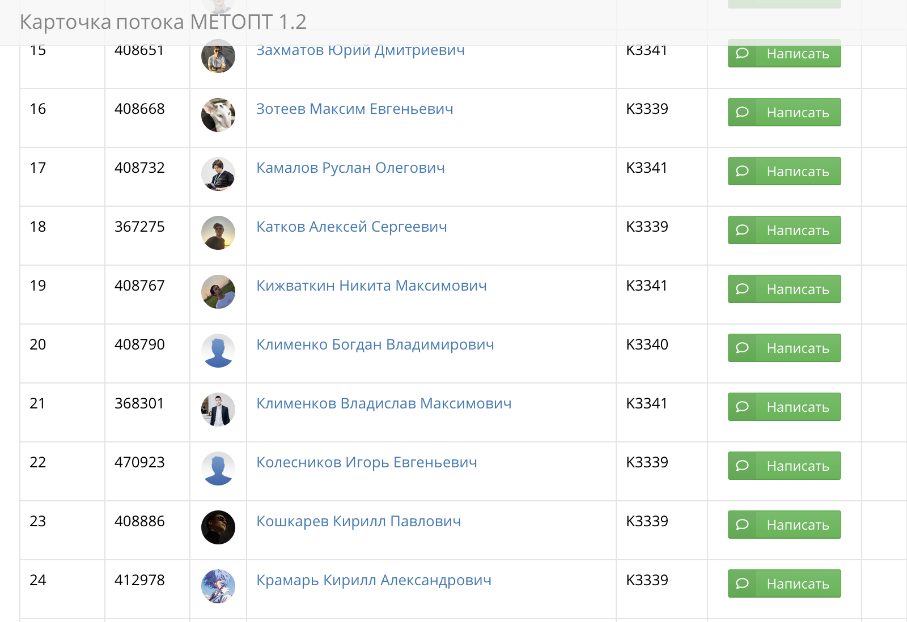
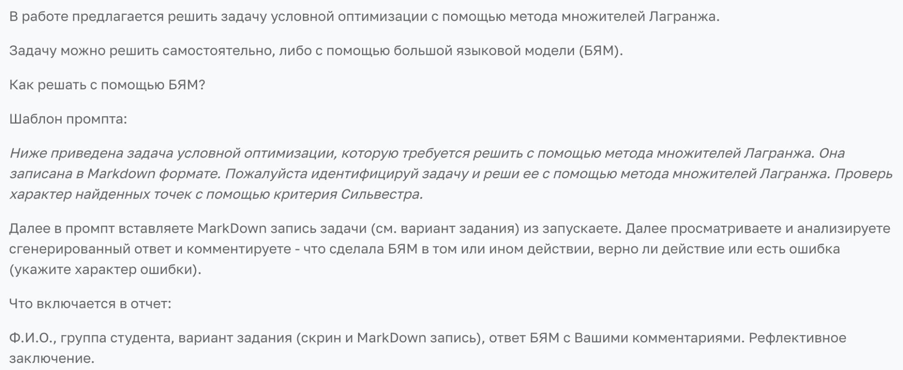
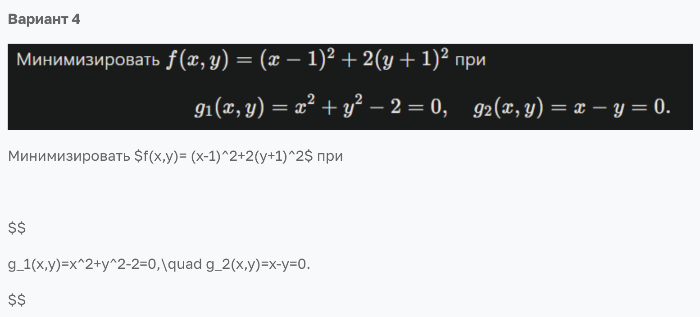

## 2. Промпт, переданный большой языковой модели (БЯМ)

Ниже приведён полный текст промпта, который был использован при обращении к БЯМ
(например, ChatGPT).

> Ниже приведена задача условной оптимизации, которую требуется решить с помощью метода множителей Лагранжа. Она записана в Markdown формате. Пожалуйста идентифицируй задачу и реши её с помощью метода множителей Лагранжа. Проверь характер найденных точек с помощью критерия Сильвестра.
>
> Минимизировать функцию
> (f(x,y) = (x - 1)^2 + 2(y + 1)^2)
> при ограничениях
> [
> \begin{cases}
> g_1(x,y) = x^2 + y^2 - 2 = 0,\
> g_2(x,y) = x - y = 0.
> \end{cases}
> ]

---

## 3. Ответ большой языковой модели ChatGPT 5.1 (БЯМ)

### 3.1. Идентификация задачи

Модель определила, что это задача **условного экстремума** функции двух переменных
с **двумя ограничениями-равенствами**:

* (g_1(x,y) = x^2 + y^2 - 2 = 0) - окружность радиуса (\sqrt{2});
* (g_2(x,y) = x - y = 0) - прямая (x = y).

Нужно найти точки пересечения этих кривых и исследовать функцию (f(x,y)) в этих точках.

---

### 3.2. Решение методом множителей Лагранжа

Строится функция Лагранжа:
$$
L(x,y,\lambda_1,\lambda_2) =
(x - 1)^2 + 2(y + 1)^2

* \lambda_1 (x^2 + y^2 - 2)
* \lambda_2 (x - y).
  $$

Необходимые условия экстремума:
$$
\begin{cases}
\dfrac{\partial L}{\partial x} = 0,\
\dfrac{\partial L}{\partial y} = 0,\
g_1(x,y) = 0,\
g_2(x,y) = 0.
\end{cases}
$$

Вычисляются частные производные:
$$
\begin{aligned}
\dfrac{\partial L}{\partial x}
&= 2(x - 1) + 2\lambda_1 x + \lambda_2 = 0,[2mm]
\dfrac{\partial L}{\partial y}
&= 4(y + 1) + 2\lambda_1 y - \lambda_2 = 0,[2mm]
x^2 + y^2 - 2 &= 0,\
x - y &= 0.
\end{aligned}
$$

Из условия (x - y = 0) следует:
$$
x = y.
$$

Подставляя в уравнение окружности:
$$
x^2 + x^2 - 2 = 0
\Rightarrow 2x^2 = 2
\Rightarrow x^2 = 1
\Rightarrow x = \pm 1,\quad y = \pm 1.
$$

Получаем **два кандидата на условный экстремум**:
$$
(1,1),\quad (-1,-1).
$$

Далее модель находит множители Лагранжа для полноты.

#### Точка ((1,1))

Подстановка (x=y=1) даёт систему:
$$
\begin{cases}
2(1 - 1) + 2\lambda_1\cdot1 + \lambda_2 = 0
\Rightarrow 2\lambda_1 + \lambda_2 = 0,[1mm]
4(1 + 1) + 2\lambda_1\cdot1 - \lambda_2 = 0
\Rightarrow 8 + 2\lambda_1 - \lambda_2 = 0.
\end{cases}
$$

Складывая уравнения, получаем:
$$
8 + 4\lambda_1 = 0 \Rightarrow \lambda_1 = -2,
$$
а затем
$$
2(-2) + \lambda_2 = 0 \Rightarrow \lambda_2 = 4.
$$

#### Точка ((-1,-1))

Подстановка (x=y=-1) даёт:
$$
\begin{cases}
2(-1 - 1) + 2\lambda_1(-1) + \lambda_2 = 0
\Rightarrow -4 - 2\lambda_1 + \lambda_2 = 0,[1mm]
4(-1 + 1) + 2\lambda_1(-1) - \lambda_2 = 0
\Rightarrow -2\lambda_1 - \lambda_2 = 0.
\end{cases}
$$

Из второго уравнения:
$$
\lambda_2 = -2\lambda_1.
$$

Подставляя в первое:
$$
-4 - 2\lambda_1 - 2\lambda_1 = 0
\Rightarrow -4 - 4\lambda_1 = 0
\Rightarrow \lambda_1 = -1,\quad \lambda_2 = 2.
$$

---

### 3.3. Значения функции в найденных точках

Вычисляются значения целевой функции:
$$
\begin{aligned}
f(1,1) &= (1 - 1)^2 + 2(1 + 1)^2 = 0 + 2\cdot4 = 8,\
f(-1,-1) &= (-1 - 1)^2 + 2(-1 + 1)^2 = 4 + 2\cdot0 = 4.
\end{aligned}
$$

Допустимое множество (пересечение окружности и прямой) состоит только из точек
((1,1)) и ((-1,-1)), поэтому:

* ((-1,-1)) даёт **минимальное** значение (f = 4);
* ((1,1)) даёт **максимальное** значение (f = 8).

Итоговый вывод модели:
$$
\boxed{
\text{Условный минимум: } (-1,-1),\ f_{\min} = 4; \quad
\text{условный максимум: } (1,1),\ f_{\max} = 8.
}
$$

---

### 3.4. Проверка характера точек (критерий Сильвестра)

Модель строит Гессиан Лагранжиана по переменным (x,y).

Вторые производные целевой функции:
$$
f_{xx} = 2,\quad f_{yy} = 4,\quad f_{xy} = 0.
$$

Вторые производные ограничения (g_1 = x^2 + y^2 - 2):
$$
(g_1)*{xx} = 2,\quad (g_1)*{yy} = 2,\quad (g_1)_{xy} = 0.
$$

Ограничение (g_2) линейно, его вторые производные равны нулю.

Следовательно, матрица Гессе Лагранжиана имеет вид:
$$
\nabla^2_{x,y} L =
\begin{pmatrix}
2 + 2\lambda_1 & 0\
0 & 4 + 2\lambda_1
\end{pmatrix}.
$$

#### В точке ((1,1)), (\lambda_1 = -2)

$$
H_1 =
\begin{pmatrix}
2 + 2(-2) & 0\
0 & 4 + 2(-2)
\end{pmatrix}
=============

\begin{pmatrix}
-2 & 0\
0 & 0
\end{pmatrix}.
$$

Главные миноры:
$$
\Delta_1 = -2 < 0,\quad
\Delta_2 = \det H_1 = 0.
$$

Матрица вырождена, поэтому по классическому критерию Сильвестра (для строгой
определённости) сделать однозначный вывод нельзя.

#### В точке ((-1,-1)), (\lambda_1 = -1)

$$
H_2 =
\begin{pmatrix}
2 + 2(-1) & 0\
0 & 4 + 2(-1)
\end{pmatrix}
=============

\begin{pmatrix}
0 & 0\
0 & 2
\end{pmatrix}.
$$

Главные миноры:
$$
\Delta_1 = 0,\quad
\Delta_2 = \det H_2 = 0.
$$

Снова получаем вырожденную матрицу, и строгий вывод по критерию Сильвестра невозможен.
Модель отмечает, что в такой ситуации характер точек удобно устанавливать
по прямому сравнению значений функции в допустимых точках, как сделано выше:
((-1,-1)) соответствует минимуму, а ((1,1)) — максимуму.

### 3.5 Скриншоты ответов LLM

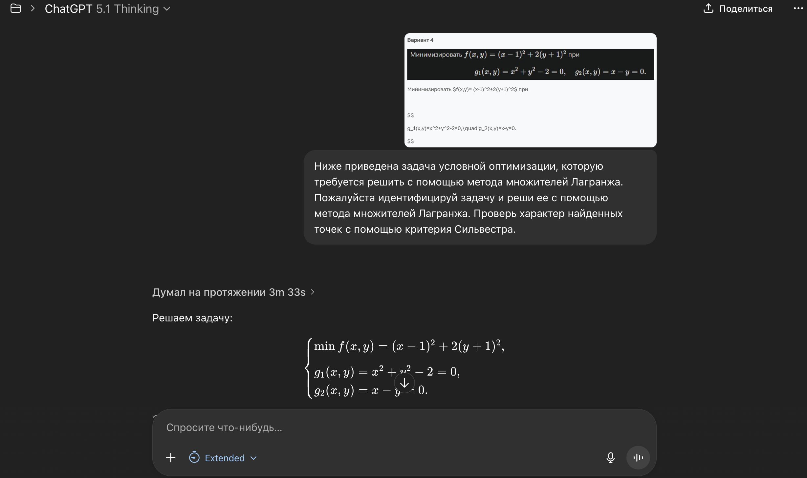
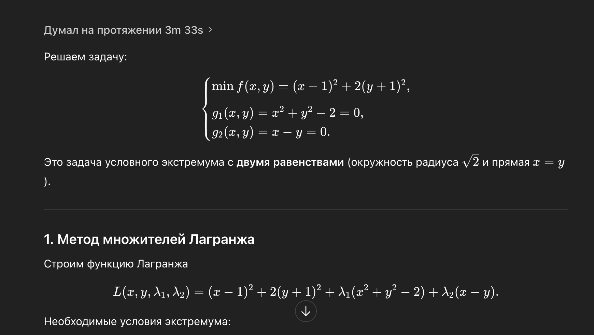
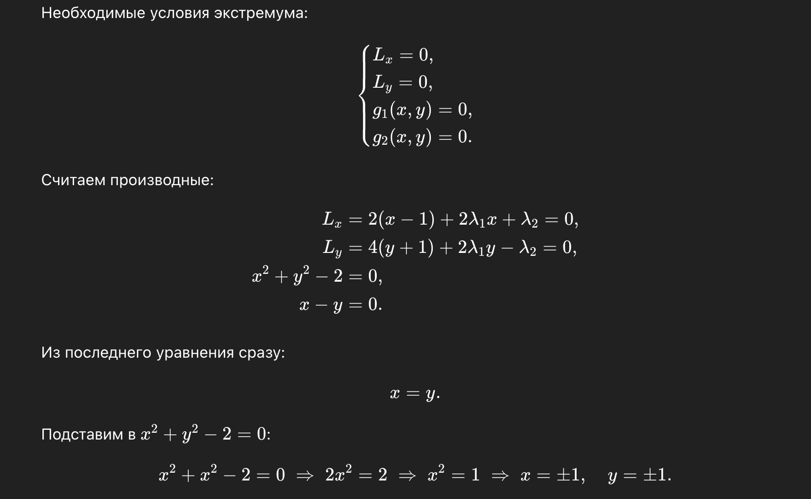
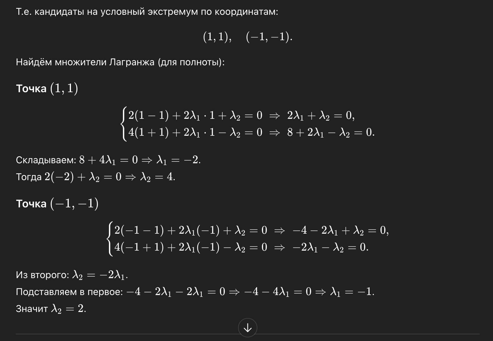
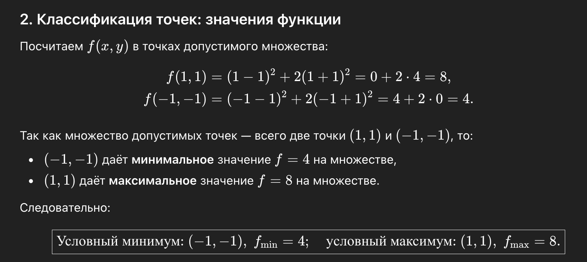

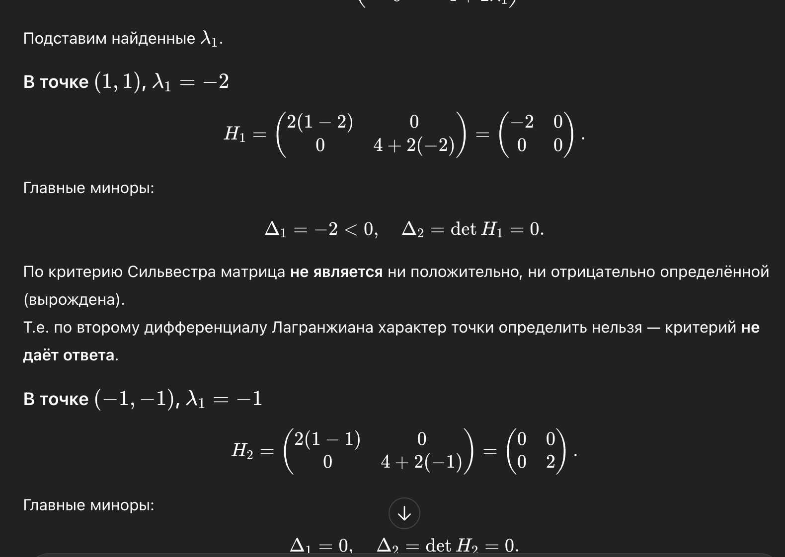
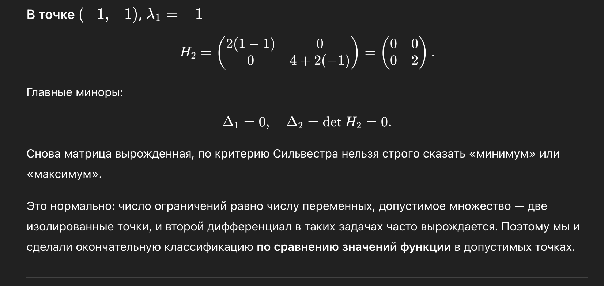
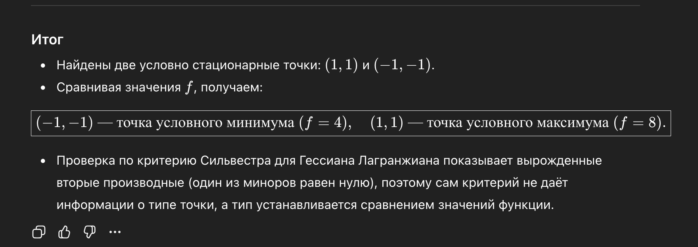

---

## 4. Комментарии к ответу БЯМ

В этом разделе приведены мои комментарии к каждому важному шагу, выполненному БЯМ.

1. **Идентификация задачи.**
   Модель корректно определила тип задачи: условный экстремум с двумя
   равенствами. Геометрическая интерпретация ограничений (окружность
   и прямая) верная и помогает понять, почему допустимое множество
   состоит из всего двух точек.

2. **Запись функции Лагранжа.**
   Функция Лагранжа составлена правильно:
   к целевой функции добавлены оба ограничения с соответствующими множителями.

3. **Система уравнений первого порядка.**
   Частные производные посчитаны без ошибок, ограничения (g_1 = 0), (g_2 = 0) просто переписаны.
   Важно, что модель сразу использует равенство (x=y), что сильно упрощает
   последующие вычисления.

4. **Поиск стационарных точек.**
   Подстановка (x=y) в уравнение окружности даёт.
   Это действительно все точки пересечения окружности и прямой.
   Полученные точки ((1,1)) и ((-1,-1)) - единственные кандидаты на условный экстремум.
   Здесь ошибок нет.

5. **Нахождение множителей Лагранжа.**
   Расчёт в обеих точках выполнен корректно:
   уравнения составлены и решены алгебраически без ошибок.
   Эти значения не обязательны для ответа, но показывают более полный ход решения.

6. **Сравнение значений целевой функции.**
   Значения (f(1,1)=8) и (f(-1,-1)=4) вычислены правильно.
   Так как допустимое множество состоит только из двух точек,
   прямое сравнение значений полностью определяет минимум и максимум.
   Вывод БЯМ о том, что ((-1,-1)) - точка условного минимума,
   а ((1,1)) - условного максимума, **верен**.

7. **Критерий Сильвестра.**

   * Гессиан Лагранжиана вычислен правильно.
   * Модель верно заметила, что главные миноры в обеих точках
     либо отрицательны/нулевые, либо нулевые, то есть матрица
     вырождена и стандартный (строгий) критерий Сильвестра
     для положительной/отрицательной определённости неприменим.
   * Фактически, в точке ((-1,-1)) матрица положительно **полу**определённая,
     а в точке ((1,1)) - отрицательно полуопределённая, что согласуется со
     найденным минимумом и максимумом, но для этого нужно уже анализировать
     собственные значения, а не только главные миноры.
     Важно, что БЯМ не делает ложных выводов и честно указывает на ограниченность
     применения критерия Сильвестра в этой задаче.

8. **Общий вывод по корректности решения.**
   Все ключевые алгебраические вычисления выполнены корректно.
   Тип найденных точек (условный минимум и максимум) определён правильно.
   Дополнительный анализ через критерий Сильвестра проведён корректно
   с точки зрения теории: показано, что строгий критерий здесь не даёт
   окончательного ответа, и поэтому используется сравнение значений функции.

---

## 5. Рефлексивное заключение

В данной лабораторной работе я использовал большую языковую модель (БЯМ)
как помощника при решении задачи условной оптимизации.

Плюсы использования БЯМ:

* Модель быстро и без вычислительных ошибок выполнила рутинные шаги:
  построение функции Лагранжа, вычисление производных, решение системы уравнений.
* Ответ получился структурированным: отдельно описана постановка задачи,
  ход решения и анализ по второму порядку (Гессиан, критерий Сильвестра).
* Благодаря комментариям модели стало понятнее, что происходит на каждом шаге:
  почему вводится Лагранжиан, как именно используются ограничения
  и откуда берутся стационарные точки.

Ограничения и мои наблюдения:

* Несмотря на корректность ответа, полностью полагаться на модель нельзя:
  необходимо самостоятельно проверять алгебру и понимать теоретические моменты.
* Важный пример - критерий Сильвестра: модель указала, что матрица вырожденная
  и строгий критерий неприменим. Без собственного понимания легко
  сделать ошибочный вывод о типе точки.
* Для более глубокого понимания полезно не только читать ответ,
  но и пытаться воспроизвести вычисления вручную (например, ещё раз
  решить систему уравнений или самому посчитать Гессиан).

**Вывод:** использование БЯМ заметно ускоряет решение задач и помогает не
застревать на технических деталях, но при этом не заменяет понимание теории.
В этой лабораторной работе модель дала корректное решение и помогла
лучше разобраться с методом множителей Лагранжа и проверкой характера
критических точек, а моя задача как студента - критически оценить ответ
и осознанно подтвердить каждый шаг.
